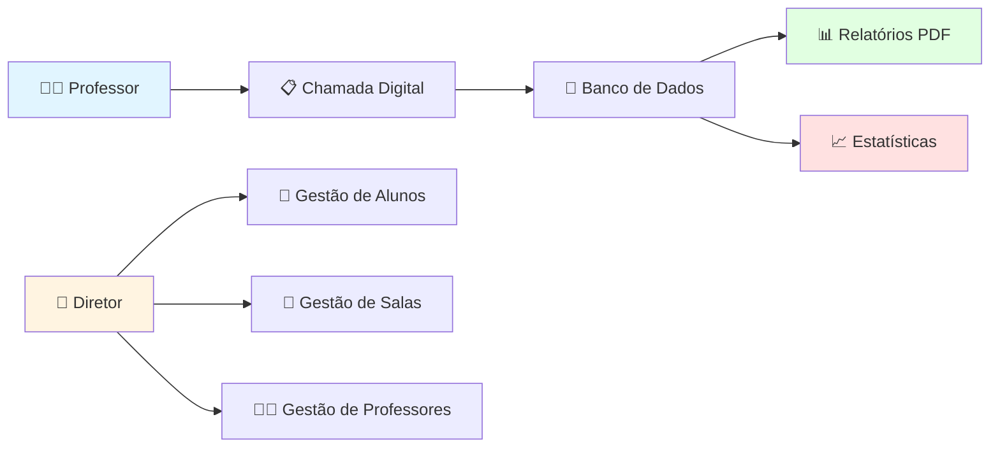
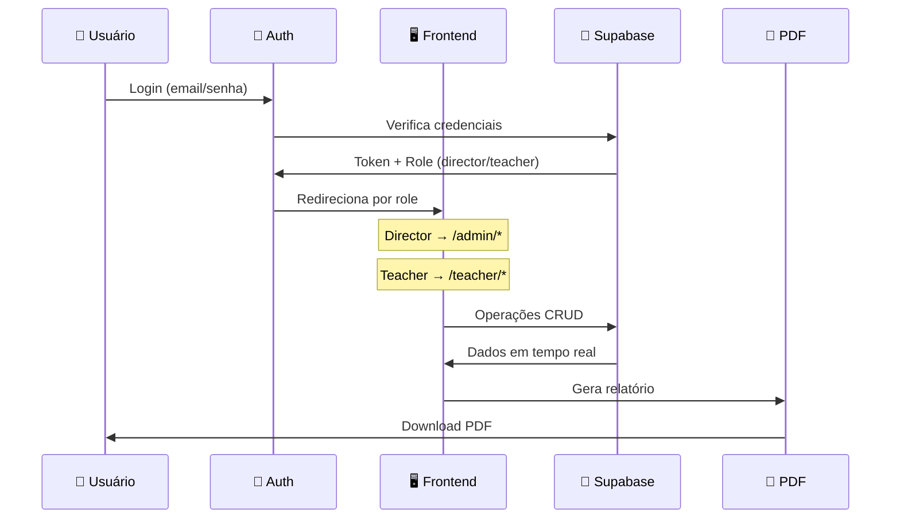

# 🏫 CCA Chamada Digital

### Sistema de Gestão de Presença e Atividades para Centro de Convivência

[](https://ccairmaagostinachamada.lovable.app)
[]()

[](https://react.dev/)
[](https://www.typescriptlang.org/)
[](https://supabase.com/)
[](https://tailwindcss.com/)
[](LICENSE)

**Instituição:** CCA Irmã Agostina | **Tipo:** OSC (Organização da Sociedade Civil) | **Vínculo:** Prefeitura Municipal

---

## 📖 Índice

- [💭 Por Que Este Projeto Existe?](#-por-que-este-projeto-existe)
- [🎯 Sobre o Projeto](#-sobre-o-projeto)
- [✨ Funcionalidades](#-funcionalidades)
- [🛠️ Tecnologias](#️-tecnologias)
- [🏗️ Arquitetura](#️-arquitetura)
- [👥 Perfis de Usuário](#-perfis-de-usuário)
- [📊 Módulos do Sistema](#-módulos-do-sistema)
- [🚀 Como Acessar](#-como-acessar)
- [🔒 Segurança](#-segurança)
- [📄 Licença](#-licença)

---

## 💭 Por Que Este Projeto Existe?

### 📋 O Desafio da Gestão Manual

Os Centros de Convivência da Criança e do Adolescente (CCA) são espaços fundamentais para o desenvolvimento social de crianças em situação de vulnerabilidade. No entanto, a gestão manual de presença e atividades apresenta diversos desafios:

| ❌ Situação Anterior | ✅ Nossa Solução |
|---------------------|------------------|
| Chamada em papel, sujeita a perdas | Sistema digital com backup na nuvem |
| Relatórios mensais feitos manualmente | Geração automática de PDF |
| Dificuldade em acompanhar frequência | Dashboard com estatísticas em tempo real |
| Comunicação fragmentada | Cronograma de atividades centralizado |
| Dados dispersos em cadernos | Banco de dados organizado e seguro |

### 🎯 Nossa Missão

> ### *"Digitalizar para cuidar melhor"*
> 
> Queremos que educadores e gestores do CCA possam dedicar mais tempo ao que realmente importa: 
> o desenvolvimento das crianças e adolescentes atendidos.
> 
> **Menos burocracia. Mais cuidado.**

---

## 🎯 Sobre o Projeto

O **CCA Chamada Digital** é um sistema web completo desenvolvido para automatizar e otimizar a gestão de presença e atividades do Centro de Convivência da Criança e do Adolescente Irmã Agostina, uma Organização da Sociedade Civil (OSC) vinculada à Prefeitura Municipal.

### 🌟 Destaques



---

## ✨ Funcionalidades

### 📌 Para Diretores (Admin)

| Módulo | Funcionalidade |
|:------:|:---------------|
| 📊 **Dashboard** | Visão geral com estatísticas de presença e atividades |
| 👥 **Alunos** | Cadastro completo com dados pessoais, familiares e escolares |
| 🏫 **Salas** | Gerenciamento de turmas e salas de aula |
| 👨‍🏫 **Professores** | Criação e gestão de contas de professores |
| 📋 **Presença** | Visualização consolidada de frequência |
| 📈 **Analytics** | Gráficos e métricas de acompanhamento |
| 📄 **Relatórios PDF** | Exportação mensal por sala com estatísticas |

### 📌 Para Professores

| Módulo | Funcionalidade |
|:------:|:---------------|
| 🏠 **Home** | Painel inicial com resumo do dia |
| ✅ **Chamada** | Registro de presença diária dos alunos |
| 📅 **Atividades** | Cronograma mensal de atividades planejadas |
| 📊 **Estatísticas** | Acompanhamento de frequência da turma |

---

## 🛠️ Tecnologias

### 📚 Stack Tecnológico

| Categoria | Tecnologia | Função |
|:---------:|:----------:|:------:|
| **Frontend** | React 18 + TypeScript | Interface de usuário moderna e tipada |
| **Estilização** | Tailwind CSS + shadcn/ui | Design system consistente e responsivo |
| **Roteamento** | React Router v6 | Navegação SPA |
| **Estado** | TanStack Query | Gerenciamento de cache e requisições |
| **Backend** | Lovable Cloud | Banco de dados PostgreSQL + Auth |
| **Autenticação** | Supabase Auth | Login seguro com controle de sessão |
| **PDF** | jsPDF + jspdf-autotable | Geração de relatórios |
| **Deploy** | Lovable | Hospedagem e CI/CD automático |

### 🎨 UI/UX

- ✅ Design responsivo (mobile-first)
- ✅ Tema claro com tons de azul institucional
- ✅ Componentes acessíveis (shadcn/ui)
- ✅ Feedback visual com toast notifications
- ✅ Loading states e skeletons

---

## 🏗️ Arquitetura

### 📁 Estrutura do Projeto

```
src/
├── 📄 App.tsx                      # Roteamento principal
├── 📄 main.tsx                     # Entry point
│
├── 🎨 index.css                    # Estilos globais e design tokens
│
├── 📁 components/                  # Componentes reutilizáveis
│   ├── layouts/                    # Layouts (Admin, Teacher)
│   ├── ui/                         # Componentes shadcn/ui
│   └── admin/                      # Componentes específicos admin
│
├── 📁 pages/                       # Páginas da aplicação
│   ├── admin/                      # Páginas do diretor
│   │   ├── Dashboard.tsx
│   │   ├── Students.tsx
│   │   ├── Classrooms.tsx
│   │   ├── Teachers.tsx
│   │   ├── Attendance.tsx
│   │   └── Analytics.tsx
│   └── teacher/                    # Páginas do professor
│       ├── Home.tsx
│       ├── TakeAttendance.tsx
│       ├── Activities.tsx
│       └── Stats.tsx
│
├── 📁 contexts/                    # Contextos React
│   └── AuthContext.tsx             # Autenticação e roles
│
├── 📁 hooks/                       # Hooks customizados
│
├── 📁 integrations/                # Integrações externas
│   └── supabase/                   # Cliente Supabase
│
├── 📁 types/                       # Tipos TypeScript
│   └── database.ts                 # Tipos do banco de dados
│
└── 📁 lib/                         # Utilitários
    └── utils.ts                    # Funções auxiliares
```

### 🔄 Fluxo de Dados



---

## 👥 Perfis de Usuário

### 👔 Diretor (Director)

| Permissão | Descrição |
|:---------:|:----------|
| ✅ **CRUD Alunos** | Criar, visualizar, editar e arquivar alunos |
| ✅ **CRUD Salas** | Gerenciar todas as salas/turmas |
| ✅ **CRUD Professores** | Criar e gerenciar contas de professores |
| ✅ **Visualizar Presença** | Acesso a todos os registros de presença |
| ✅ **Relatórios** | Gerar PDFs mensais por sala |
| ✅ **Analytics** | Acesso a métricas e gráficos |

### 👨‍🏫 Professor (Teacher)

| Permissão | Descrição |
|:---------:|:----------|
| ✅ **Visualizar Alunos** | Ver alunos das salas |
| ✅ **Registrar Presença** | Fazer chamada diária |
| ✅ **CRUD Atividades** | Gerenciar próprio cronograma |
| ✅ **Estatísticas** | Ver frequência da turma |
| ❌ **Gerenciar Usuários** | Sem acesso |

---

## 📊 Módulos do Sistema

### 📋 Cadastro de Alunos

Informações completas seguindo padrões de assistência social:

| Categoria | Campos |
|:---------:|:-------|
| **Dados Básicos** | Nome, idade, data de nascimento, gênero |
| **Documentos** | RG, CPF |
| **Família** | Nome da mãe, telefone dos responsáveis |
| **Escola** | Sala, professor responsável, horários |

### 📅 Cronograma de Atividades

Sistema de planejamento mensal para professores:

```
┌─────────────────────────────────────┐
│  FEVEREIRO 2026                     │
├────┬────┬────┬────┬────┬────┬────┤
│ D  │ S  │ T  │ Q  │ Q  │ S  │ S  │
├────┼────┼────┼────┼────┼────┼────┤
│    │    │    │    │    │    │ 1  │
│ 2  │ 3  │ 4  │ 5  │ 6  │ 7● │ 8  │
│ 9  │10  │11  │12  │13  │14  │15  │
└────┴────┴────┴────┴────┴────┴────┘
        
● Dia 07/02: Aula de Pintura 🎨
```

### 📄 Relatório PDF Mensal

Exportação automática contendo:
- ✅ Cabeçalho com nome da sala e período
- ✅ Lista de alunos com presença diária (P/F)
- ✅ Total de presenças e faltas por aluno
- ✅ Taxa de frequência individual e geral
- ✅ Estatísticas consolidadas do mês

---

## 🚀 Como Acessar

### 🌐 Acesso ao Sistema

**URL de Produção:** [https://ccairmaagostinachamada.lovable.app](https://ccairmaagostinachamada.lovable.app)

### 🔐 Fluxo de Acesso

1. **Diretor** acessa o sistema e faz login
2. **Diretor** cria conta para professor (email + senha temporária)
3. **Diretor** compartilha credenciais com o professor
4. **Professor** acessa o mesmo link e faz login
5. Sistema redireciona automaticamente conforme o perfil

### 📱 Requisitos

- Navegador moderno (Chrome, Firefox, Safari, Edge)
- Conexão com internet
- Funciona em desktop, tablet e celular

---

## 🔒 Segurança

### 🛡️ Medidas Implementadas

| Recurso | Descrição |
|:-------:|:----------|
| **RLS (Row Level Security)** | Políticas de acesso por usuário no banco de dados |
| **Autenticação JWT** | Tokens seguros com expiração |
| **Roles Separadas** | Tabela dedicada para controle de papéis |
| **Senhas Hasheadas** | Criptografia bcrypt pelo Supabase Auth |
| **HTTPS** | Comunicação criptografada |
| **Edge Functions** | Operações sensíveis executadas no servidor |

### 📋 Conformidade

- ✅ Dados armazenados em nuvem segura
- ✅ Backup automático
- ✅ Sem exposição de dados sensíveis no frontend
- ✅ Logs de auditoria de alterações

---

## 🛠️ Desenvolvimento

### 🧰 Tecnologias de Desenvolvimento

```bash
# Framework
Lovable (AI-powered development)

# Package Manager
Bun

# Build Tool
Vite

# Linting
ESLint + TypeScript
```

### 📦 Principais Dependências

```json
{
  "react": "^18.3.1",
  "react-router-dom": "^6.30.1",
  "@tanstack/react-query": "^5.83.0",
  "@supabase/supabase-js": "^2.95.3",
  "tailwindcss": "^3.4",
  "jspdf": "^4.1.0",
  "date-fns": "^3.6.0",
  "lucide-react": "^0.462.0"
}
```

---

## 📄 Licença

Este projeto está sob a licença **MIT**. 

```
MIT License - Copyright (c) 2025 CCA Irmã Agostina
```

---

## 🙏 Agradecimentos

### Nossos sinceros agradecimentos:

- 🏫 **CCA Irmã Agostina** - Pela confiança e parceria no desenvolvimento
- 🏛️ **Prefeitura Municipal** - Pelo apoio institucional
- 👨‍🏫 **Equipe de Educadores** - Pelos feedbacks e validações
- 💜 **Lovable** - Pela plataforma de desenvolvimento

---

## 📞 Contato

**Dúvidas ou sugestões sobre o sistema?**

Entre em contato com a coordenação do CCA Irmã Agostina.

---

<div align="center">

### 💙 Feito com carinho para o CCA Irmã Agostina

**Cuidando do presente, construindo o futuro.**

</div>
